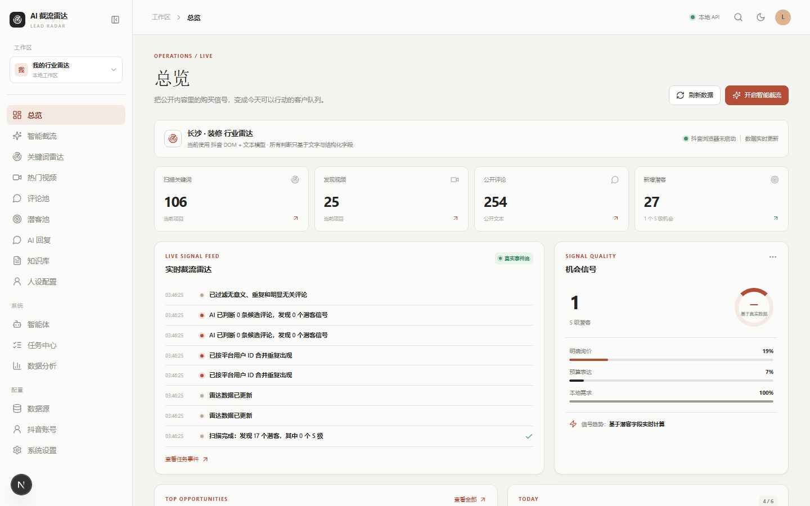
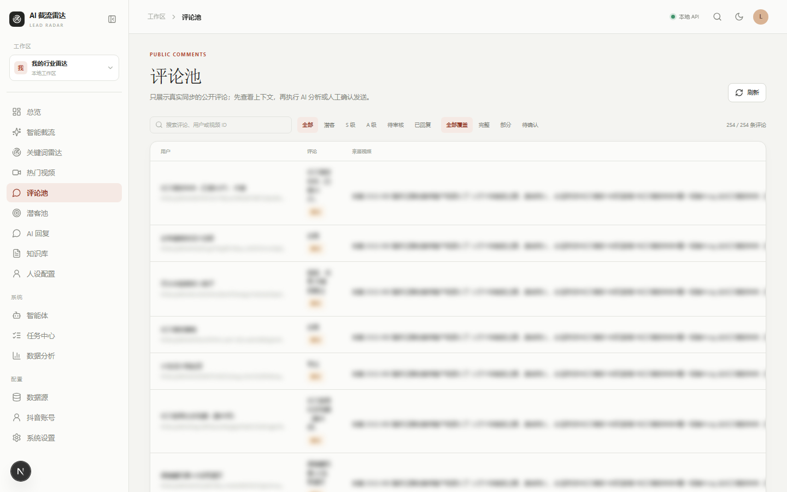
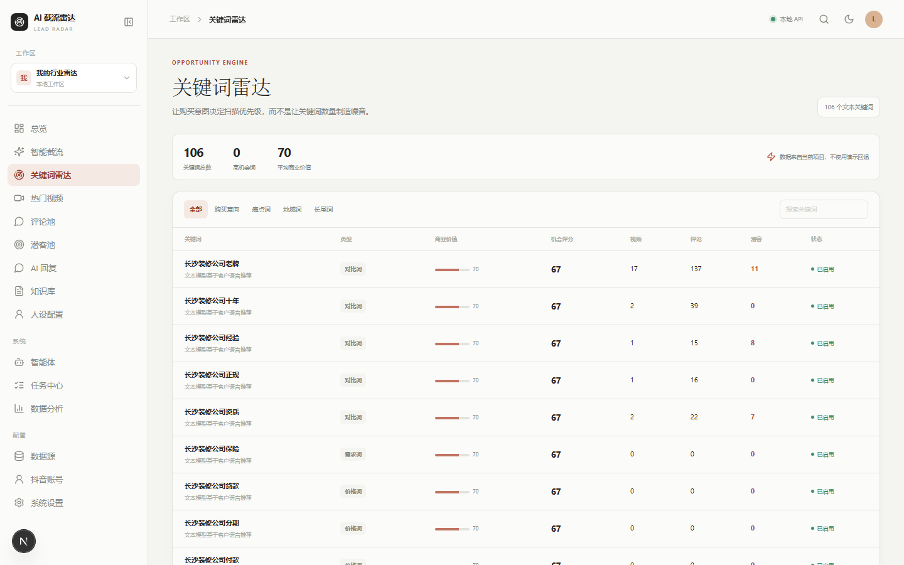
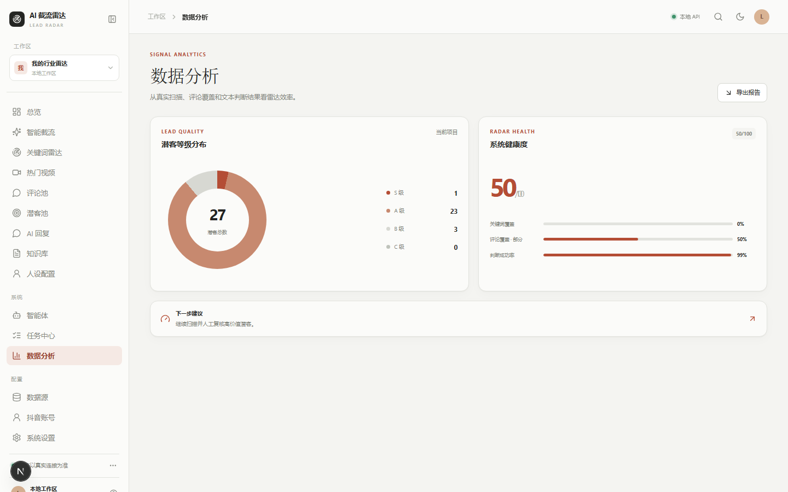
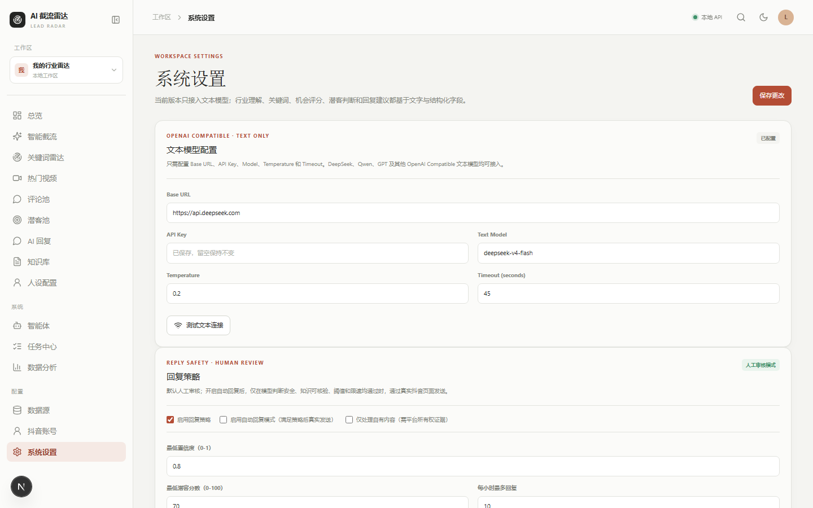

# AI 截流雷达 / AI Lead Radar

把抖音公开内容里的购买信号，整理成今天可以行动的客户队列。

AI 截流雷达是一个 Windows 优先、桌面端优先的抖音 AI 评论获客工作台：从行业与客户画像出发生成关键词，使用真实登录后的抖音页面采集公开视频和公开评论，再用规则预筛与文本模型判断潜客，最后进入人工审核、AI 回复和跟进闭环。

第一版严格只使用文本模型、DOM 文本、结构化字段、公开视频元数据和公开评论，不接入任何视觉模型。

## 产品界面

以下截图来自本地真实运行的产品页面。截图中的业务数据会随本地数据库和抖音采集结果变化；仓库不会提交数据库、Cookie、浏览器 Profile 或 API Key。

| 总览：从信号到行动                                | 评论池：先看上下文，再审核回复           |
| ------------------------------------------------- | ---------------------------------------- |
|  |  |

| 关键词雷达：按机会优先级扫描                 | 数据分析：查看潜客质量与覆盖率              |
| -------------------------------------------- | ------------------------------------------- |
|  |  |

| 系统设置：只配置文本模型                       |
| ---------------------------------------------- |
|  |

## 真实可用的产品链路

```
行业 / 地区 / 业务 / 客户画像
        ↓
IndustryAgent：行业理解与客户语言
        ↓
KeywordAgent：核心词、需求词、价格词、问题词、地域词、长尾词
        ↓
抖音真实登录态：关键词 → 视频 → 公开评论
        ↓
RadarAgent：标题、description、作者和互动元数据机会评分
        ↓
RulePreFilter：过滤“哈哈哈”、表情、无意义支持等低价值评论
        ↓
LeadJudgeAgent：合并一级评论、二级回复和历史评论，判断潜客
        ↓
潜客池 → 人工跟进 → AI 回复草稿 → 人工确认发送
```

### 1. 项目与行业工作区

- 为不同业务建立独立项目，隔离行业、地区、关键词、评论、潜客和回复策略。
- 项目内维护行业信息、业务描述、目标客户、客单价、知识库和用户人设。
- 首页实时展示扫描关键词、发现视频、公开评论、新增潜客和 S 级机会。

### 2. AI 行业理解与关键词雷达

IndustryAgent 使用文本模型生成行业摘要、目标客户画像、痛点、购买触发因素、常见问题、客户语言、竞品类型和搜索策略。

KeywordAgent 根据行业、地区、业务、客户画像、痛点和客户语言生成并分类管理关键词，包括：

- 核心词、需求词、购买意图词、价格词、问题词、痛点词
- 避坑词、竞品词、地域词、场景词、人群词、长尾词

关键词列表带有商业价值、机会评分、视频数、评论数和潜客数，扫描时按机会排序。目标范围为每个项目 100～300 个可管理关键词。

### 3. 抖音真实采集

- 使用用户登录后的持久化 Chromium Profile，不把 Cookie 写入代码或数据库。
- 真实链路为“关键词 → 搜索结果视频 → 视频详情 → 公开评论”。
- 采集视频标题、description、作者、发布时间、点赞、评论、分享、收藏等公开元数据。
- 采集一级评论、作者回复和可见二级回复，并保存来源视频链接与采集覆盖状态。
- 支持 10、15、20、25、30 分钟自动采集计划；任务、checkpoint、事件日志和下次运行时间持久化。
- 支持 douyin-comments-crawler 外部服务适配，但 Playwright Provider 可以直接完成主链路。
- 采集失败、未登录、风控验证或 DOM 结构变化时，任务会记录明确错误，不伪造成功数据。

### 4. RadarAgent 视频机会判断

视频相关度完全来自文本和结构化字段，不分析画面。评分输入包括：

- 关键词、标题、description、作者
- 发布时间、点赞数、评论数、分享数、收藏数
- 行业相关度、商业相关度、评论活跃度和历史潜客密度

输出行业相关度、商业相关度、潜客机会度和 video_opportunity_score，用于决定下一轮优先扫描哪些关键词和视频。

### 5. 评论池与 LeadJudgeAgent

- 评论池支持搜索和潜客、S 级、A 级、待审核、已回复筛选。
- 规则预筛先过滤明显无价值评论，目标是减少至少 50% 不必要的 LLM 调用。
- LeadJudgeAgent 只分析评论文本和业务上下文，输出潜客判断、评分、意向等级、需求、地区、预算、时间要求、购买阶段、痛点、购买信号、摘要、理由和推荐动作。
- 如果存在多次评论，会按用户合并为历史需求上下文。例如“长沙有没有？”、“120 平多少钱？”、“年底准备装。”会作为同一个用户的连续需求交给文本模型判断。
- 每条评论可查看来源视频、上下文、AI 判断原因、覆盖范围和回复状态。

### 6. 潜客池与 AI 回复

- 潜客按 S/A/B/C 分级，保留评分、意向、需求、预算、地区、时间和购买阶段。
- 支持人设配置、知识库文本和回复策略，为潜客生成可编辑的回复草稿。
- 默认人工审核；点击确认后才会通过真实 Playwright 链路发送，并重新读取 DOM 验证结果。
- 自动回复必须由用户主动开启，并同时满足意图、置信度、潜客分数、知识库、敏感风险和限速规则。
- 回复发送具备幂等保护、失败恢复、审核状态和事件记录，避免重复发送。

### 7. 数据分析与运行审计

- 展示 S/A/B/C 潜客分布、评论覆盖率、AI 判断成功率和系统健康度。
- 任务中心提供自动采集计划、运行状态、扫描报告、错误信息和事件日志。
- 每次 Agent Run 记录 agent_name、model、prompt_version、input_text、output_json、tokens、latency、success 和 error，不记录图片。
- 支持分析报告和潜客列表导出，方便人工跟进和复盘。

## 文本模型边界

当前系统只支持 OpenAI Compatible 文本模型，使用同一套 BaseLLMProvider / OpenAICompatibleProvider 接入：

- DeepSeek
- Qwen
- GPT 文本模型
- 其他 OpenAI Compatible 文本模型

系统不包含以下能力和依赖：

- 图片理解、视频画面理解、OCR、视频帧分析
- 封面视觉判断、多模态模型、Vision API
- 图像 embedding、视频内容识别
- VisionProvider、ImageProvider、MultimodalProvider、VideoProvider

评论链路按“规则预筛 → 候选评论 → 文本 LLM → Lead Score”分层，大量评论优先使用低延迟文本模型；行业理解、关键词和人设使用中等能力文本模型。

## 快速启动

### Windows 本地运行

要求：Python 3.13、Node.js 20+、uv，以及可运行 Chromium 的 Windows 环境。

```
uv venv .venv --python 3.13
uv pip install -e ".[test]" --python .venv\Scripts\python.exe
.venv\Scripts\playwright.exe install chromium
Copy-Item .env.example .env
.\start.ps1
```

打开：

- Web：<http://127.0.0.1:5173>
- API 文档：<http://127.0.0.1:8689/docs>
- 存活检查：<http://127.0.0.1:8689/health>
- 就绪检查：<http://127.0.0.1:8689/ready>

### 配置 DeepSeek 文本模型

最小配置只需要以下三个变量：

```
LLM_BASE_URL=https://api.deepseek.com
LLM_API_KEY=你的文本模型APIKey
LLM_MODEL=deepseek-chat
```

也可以在“系统设置 → 文本模型配置”中填写 Base URL、API Key、Model、Temperature 和 Timeout，并点击“测试文本连接”。API Key 只在服务端保存和使用，不会进入浏览器 bundle。

### 首次连接抖音

1. 启动服务后进入“抖音账号”。
2. 打开真实浏览器并完成扫码登录。
3. 返回“智能截流”创建或选择项目，保存行业与客户信息。
4. 运行行业理解和关键词生成。
5. 进入“任务中心 → 自动采集”，选择 10～30 分钟间隔并保存。
6. 在“热门视频”“评论池”和“潜客池”检查结果，先人工审核，再生成和发送回复。

登录态保存在 data/browser/douyin，服务重启后会复用。主 API 的 Playwright 浏览器与外部 douyin-comments-crawler 不应同时占用同一个 Chromium Profile；如需独立运行 crawler，请先关闭主 API 浏览器，或配置独立 Profile。

## Docker 部署

复制并修改环境变量后启动：

```
Copy-Item .env.example .env
docker compose up --build
```

生产环境至少设置 API_AUTH_TOKEN 和 SETTINGS_ENCRYPTION_KEY。可用以下命令生成加密密钥：

```
.venv\Scripts\python.exe -c "from cryptography.fernet import Fernet; print(Fernet.generate_key().decode())"
```

生产编排使用 /ready 作为就绪探针。数据库迁移由 Alembic 管理，当前迁移 head 为 f4e5d6c7b8a9。

## 项目结构

```
backend/app/agents       文本 Agent、Prompt 和 LLM Provider
backend/app/providers    抖音 Playwright 与外部采集适配器
backend/app/services     雷达评分、回复策略、事件总线
backend/app/tasks        采集任务、队列、调度器、checkpoint
backend/alembic          数据库迁移
web                      Next.js + React + TypeScript 前端
tests                    Provider、规则预筛、评分、调度、SSE 和迁移测试
docs                     架构、商业化验收和第三方依赖说明
```

## 验证命令

```
.venv\Scripts\python.exe -m pytest -q
cd web
npm run lint
npm run build
```

本地开发阶段已覆盖后端全量测试、前端类型检查和 Next.js 生产构建。真实抖音 E2E 仍依赖用户自己的登录态、平台页面状态和合规使用环境，验收记录见 [docs/real-acceptance-matrix.md](docs/real-acceptance-matrix.md)。

## 数据与合规边界

主系统只处理公开内容、机会判断、潜客 CRM 和人工跟进辅助。不实现验证码破解、绕过风控、批量注册、设备指纹伪造、批量骚扰私信、自动加微信或自动营销发送。外部爬虫请由使用者独立运行，并自行确认抖音平台规则与第三方项目许可证。

更多配置见 [.env.example](.env.example)、[THIRD_PARTY.md](THIRD_PARTY.md) 和 [docs/text-only-architecture.md](docs/text-only-architecture.md)。
